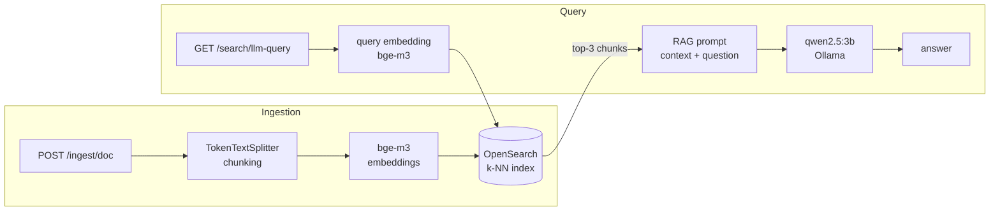

# rag-search-service

A fully local Retrieval-Augmented Generation (RAG) service built with **Spring Boot 4 / Spring AI 2.0** and **OpenSearch** as a vector store.
It ingests documents, embeds them locally, answers questions grounded in the ingested content, and keeps multi-turn chat sessions.

> Built as a learning project to explore the LLM engineering stack end-to-end:
> embedding models, chunking, vector search, prompt design, local LLM inference and Dockerized deployment.

---

## Architecture



**Two independent pipelines:**

1. **Ingestion** — a document is split into token-based chunks (`TokenTextSplitter`), each chunk is embedded with `bge-m3` (1024 dims) and stored in OpenSearch together with its source text.
2. **Query** — the user's question is embedded with the *same model*, OpenSearch runs a k-NN similarity search (cosine), the top chunks are injected into a prompt template, and a local LLM generates the grounded answer.

Only one model touches the retrieval path (`bge-m3`). The chat model is used exclusively for generation — this separation matters and is easy to lose track of.

---

## Tech stack

| Layer | Technology | Notes |
|---|---|---|
| Language | Java 21 | |
| Framework | Spring Boot 4.1.x | |
| LLM framework | Spring AI 2.0.1 | `EmbeddingModel`, `VectorStore`, `PromptTemplate`, `OllamaChatModel` |
| Embeddings | `bge-m3` via Ollama | multilingual, 1024 dims |
| Generation | `qwen2.5:3b` via Ollama | runs fully locally |
| Vector store | OpenSearch 2.15 (k-NN plugin) | exact k-NN, cosine similarity |
| Transport | opensearch-java 3.6.0 + Apache HttpClient 5 | `RestClientTransport` is deprecated in 3.x |
| Infra | Docker, docker-compose | app + OpenSearch |

---

## Endpoints

### Ingestion

```http
POST /ingest/doc
Content-Type: application/json

{ "text": "Any long document text..." }
```

Response: `{ "chunks": 3, "status": 200 }` — returns the number of chunks produced.
Fails with `400` if the text is too short to produce a single embeddable chunk.

### Retrieval (search only, no LLM)

```http
GET /search/query?q=How many vacation days do we have?
```

Returns the top-3 chunks with similarity scores:

```json
[
  { "text": "...", "score": "0.83" },
  { "text": "...", "score": "0.71" }
]
```

### RAG query (search + generation)

```http
GET /search/llm-query?q=How many vacation days do we have?
```

Returns the LLM answer grounded in the retrieved chunks. If nothing above the
similarity threshold is found, the model is explicitly told the search failed
and answers from its own knowledge (marked as such).

### Help-desk chatbot (multi-turn)

```http
POST /chat/ask
Content-Type: application/json

{ "history_id": "session-1", "prompt_message": "My internet is down" }
```

A scripted support agent for internet-connection troubleshooting with
conversation memory: pass the same `history_id` to continue a session.

### Low-level embedding playground

```http
POST /embedding/vector   { "word": "cat" }                        → float[1024]
POST /embedding/cosine   { "wordOne": "cat", "wordTwo": "dog" }   → proximity
```

Cosine similarity is computed manually (dot product + norms) — useful to see
what a vector actually is.

### Errors

All errors follow RFC 7807 (`application/problem+json`):

| Status | When |
|---|---|
| `400` | validation errors (empty text, no chunks produced, empty chat message) |
| `502` | Ollama unreachable / returned nothing |
| `503` | OpenSearch unreachable |

---

## Getting started

### Prerequisites

- JDK 21
- Docker Desktop
- [Ollama](https://ollama.com)

### 1. Pull models

```bash
ollama pull bge-m3
ollama pull qwen2.5:3b
```

### 2. Build the app

```bash
./mvnw clean package -DskipTests
```

### 3. Run everything

```bash
docker compose up -d --build
```

This starts the app (port **8083**) and OpenSearch (port **9200**).
The app reaches OpenSearch inside the compose network by service name and
reaches Ollama on the host via `host.docker.internal` (configured through
`extra_hosts: host-gateway`).

### 4. Try it

```bash
# ingest a document
curl -X POST http://localhost:8083/ingest/doc \
  -H "Content-Type: application/json" \
  -d '{"text": "Company policy. Employees get 28 vacation days per year."}'

# semantic search
curl "http://localhost:8083/search/query?q=How many vacation days?"

# full RAG answer
curl "http://localhost:8083/search/llm-query?q=How many vacation days?"

# chat with memory
curl -X POST http://localhost:8083/chat/ask \
  -H "Content-Type: application/json" \
  -d '{"history_id": "s1", "prompt_message": "My internet is down"}'
```

### Local development (outside Docker)

```bash
./mvnw spring-boot:run -Dspring-boot.run.profiles=dev
```

**Profile convention:** the *default* profile targets Docker Compose
(`opensearch:9200`, `host.docker.internal:11434`); the `dev` profile targets a
local run from an IDE (`localhost` everywhere).

---

## Design decisions

- **Why `bge-m3` and not `nomic-embed-text`.** During evaluation against a
  golden dataset, retrieval on Russian-language documents scored 2/5 with
  `nomic-embed-text` (trained predominantly on English). Switching to the
  multilingual `bge-m3` brought it to 5/5 — verified with the same dataset.
  The index mapping fixes the vector dimension (`dimensions(1024)`), so
  switching embedding models requires re-creating the index.
- **Why one embedding model in retrieval.** Query and document chunks must be
  embedded by the same model, otherwise their vectors live in different spaces
  and similarity is meaningless.
- **Manual `OpenSearchVectorStore` configuration.** The Spring AI starter's
  auto-configuration activates an AWS-flavoured client when AWS SDK classes are
  on the classpath, which breaks self-hosted setups. A manual `OpenSearchClient`
  bean (Apache HttpClient 5 transport) bypasses this entirely.
- **Similarity threshold.** Retrieval uses `similarityThreshold(0.50)` in
  addition to `topK(3)`: without it, every query returns *some* chunks, and the
  "nothing found" path would never trigger.
- **Chunking.** `TokenTextSplitter` with chunkSize=150 / minChunkSizeChars=100 /
  minChunkLengthToEmbed=20. Known pitfalls (documented in the code): no overlap
  support, trimmed tails are discarded, and the CL100K tokenizer is
  OpenAI-oriented (~1 token per 2–3 Cyrillic characters), so token counts are
  approximate.
- **Ingestion is fail-fast.** A document that produces zero chunks throws
  `IllegalArgumentException` → `400`. Nothing is silently swallowed.

## Known limitations

- Chat history is in-memory (`LinkedHashMap`, 100 sessions × 6 entries, LRU
  eviction) — restarts lose it. To be replaced with Spring AI `ChatMemory`.
- Evaluation is manual (a golden dataset of question/answer/keyword triples).
  Automated recall@k metrics are the next step.
- No hybrid search yet (BM25 + k-NN) — exact numbers, dates and codes are a
  known blind spot of pure vector search.
- OpenSearch security plugin is disabled (dev setup), no auth on the API.

## Roadmap

1. Golden-dataset runner with recall@k / MRR, chunking experiments
2. Hybrid search via OpenSearch search pipelines (BM25 + vector + RRF)
3. Spring AI `ChatMemory`, advisors, SSE streaming, LLM timeouts
4. Chat-memory persistence (PostgreSQL is already provisioned in compose)
5. Cloud deployment (AWS ECS/EKS), CI/CD

---

## Project layout

```
src/main/java/io/github/vladsmr/ragsearch/
├── embedding/    # low-level embedding API (vector generation, cosine)
├── search/       # RAG core: ingestion, vector search, LLM answers
├── chat/         # multi-turn help-desk chatbot with history
├── common/       # exceptions + RFC 7807 error handling
└── config/       # OpenSearch client / vector store beans
```

## Acknowledgements

Development was assisted by AI tooling (architecture reviews, documentation drafting).
All architectural and design decisions, implementation, and testing were done by the author.